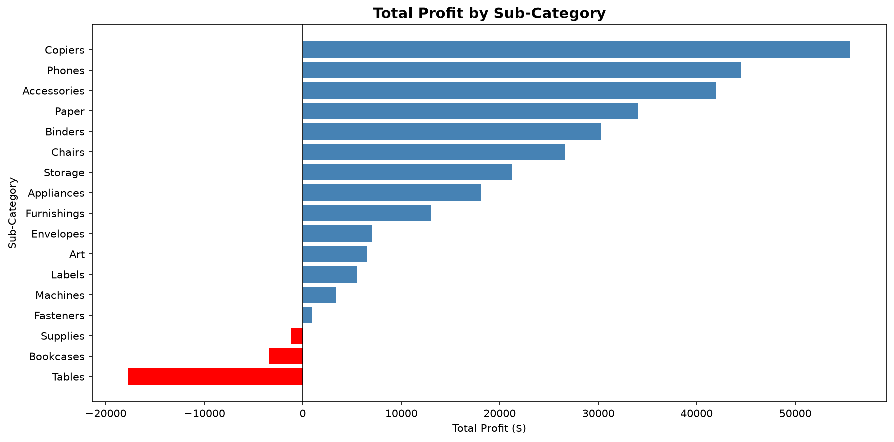
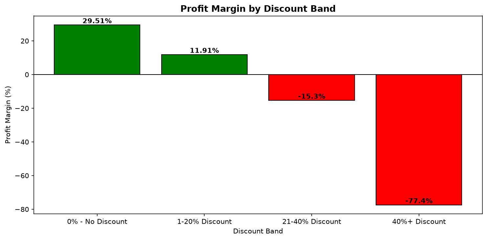
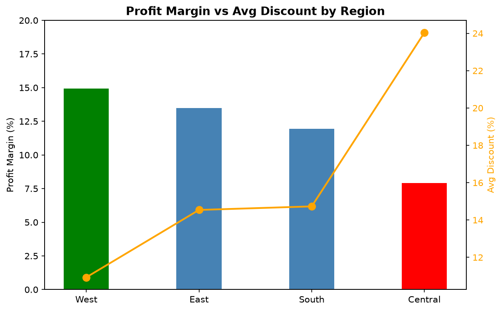
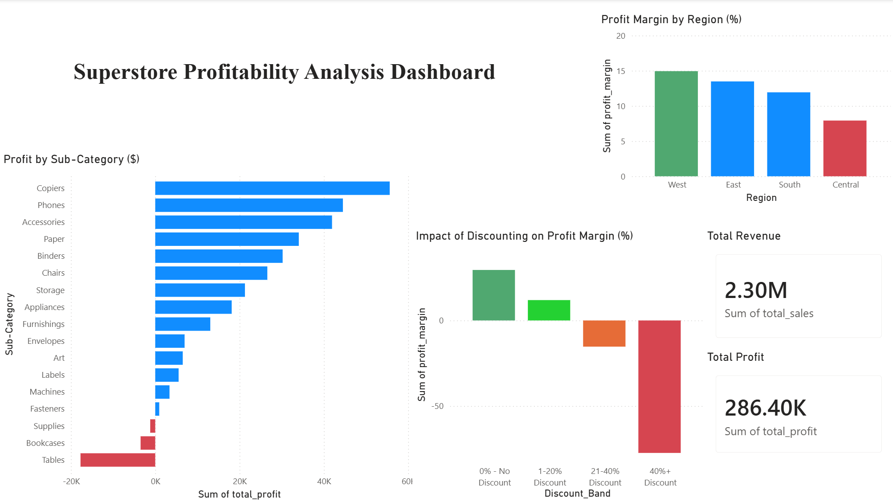

# Retail Profitability & Discount Impact Analysis

## Overview
Analysis of 9,994 orders from the Sample Superstore dataset to identify profitability drivers and the impact of discounting on margins across product categories and regions.

## Business Problem
Superstore's overall profit margin of 12.47% is being suppressed by loss-making product lines and aggressive discounting in specific regions. This project identifies the root causes and quantifies the recoverable profit.

## Tools & Stack
- **Python** — data cleaning and EDA (pandas, matplotlib, seaborn)
- **MySQL** — core analysis and aggregations
- **Power BI** — interactive dashboard
- **Business Memo** — recommendations to leadership

## Key Findings
- Furniture Tables generated $207K in revenue but recorded a net loss of $17,725 (-8.56% margin) due to 26% avg discounting
- Discounts above 20% yield -15.3% profit margin vs +29.5% for undiscounted orders — affecting 1,393 orders and $135K in recoverable annual profit
- Central region averages 24% discount rate vs 10.93% in the West, resulting in a 7.92% margin vs 14.94%

## Repository Structure
├── analysis.ipynb                 # Python cleaning and EDA
├── Sample_Superstore.csv          # Raw dataset
├── category_summary.csv           # SQL output
├── discount_impact.csv            # SQL output
├── region_profit.csv              # SQL output
├── subcategity_profit.csv         # SQL output
├── discount_impact.png            # Visualization
├── profit_by_subcategory.png      # Visualization
├── region_discount_margin.png     # Visualization
├── superstore_dashboard.png       # Power BI dashboard screenshot
├── business_memo.md               # Business recommendations
└── README.md                      # Project documentation

## Visualizations

### Profit by Subcategory

### Discount Impact on Margins

### Region Discount vs Margin

## Dashboard

## Business Memo
Full findings and recommendations available in [business_memo.md](business_memo.md)
